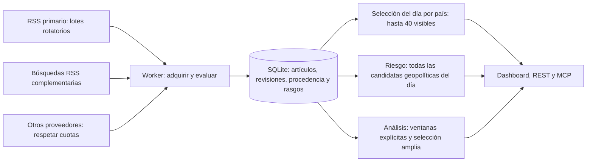

# Noticias: adquisición, SQLite y vistas recientes

Implementado el 9 de octubre de 2026. Se reutilizan `/srv/bitcoin/ogid/db/ogid.sqlite`, el worker y las migraciones 001–007. No hace falta importar otra vez ni instalar un servidor SQL. El servicio activo debe reiniciarse manualmente para cargar el código y la configuración.



## Adquisición y evaluación

La descarga y el archivado de RSS, NewsAPI, GNews y los demás proveedores configurados se ejecutan en `news.collect`, dentro del worker. Las noticias se confirman en SQL antes de devolver el resultado. RSS archiva todo el lote antes del límite de respuesta del proveedor. El backend recibe una vista previa de adquisición de hasta 100 filas para diagnóstico y proyecciones acotadas para los consumidores.

Las fuentes primarias mantienen su cursor y último resultado en `rss-feeds`; por defecto se consultan 18 cada minuto. Con 66 habilitadas, cuatro lotes cubren el catálogo; errores, deadlines y duración del ciclo pueden alargar el recorrido. Las búsquedas generadas del agregado anterior se conservan con su intervalo configurado y cursor independiente `rss-generated`. En modo legacy no vuelven a descargar las fuentes primarias. Los proveedores con cuota mantienen su programación por bandas, independiente de la actualización de vistas SQL.

La identidad canónica y sus revisiones siguen en `articles`. El análisis reciente deduplica además títulos iguales del mismo día de publicación. Las candidatas necesitan título, enlace HTTP/HTTPS y fecha de publicación válida dentro de la ventana, sin fechas futuras ni datos sintéticos. Se respetan los filtros de fuentes/dominios, admisión del archivo y políticas de contenido; no se convierte una fecha de recepción en una fecha de publicación conocida.

En cada ingesta se guardan `analysisFeatures`: países detectados, sentimiento, señales de conflicto y clasificación/importancia financiera calculados con los clasificadores existentes. Así el análisis conserva la información derivada del payload adquirido sin archivar cuerpos restringidos. Los artículos antiguos sin estos rasgos se evalúan con los metadatos que realmente conserva SQL; incorporarán los rasgos completos al volver a recibirse. No se reconstruye texto histórico inexistente.

## Vistas y cálculos

- **Live News Feed:** candidatas geopolíticas del día local, priorizadas por relevancia, actualidad y diversidad. Se procura cubrir los países seleccionados. El límite por fuente es preferente: se relaja si impide mostrar hasta 40 candidatas válidas; el control de titulares similares se mantiene. El endpoint y la interfaz seleccionan desde SQL para el país solicitado, sin limitarse a filtrar las 40 de la vista general.
- **Country Risk Metrics:** acumula todas las candidatas geopolíticas válidas del día antes de aplicar límites de selección. Mantiene la fórmula y los umbrales existentes; la ampliación del corpus cambia las puntuaciones. Los contadores diarios reinician a medianoche en la zona configurada. Las noticias puramente financieras no se convierten en señales de riesgo geopolítico.
- **Impacto, predicciones y consumidores recientes:** usan la proyección SQL de la ventana configurada, 36 horas por defecto, con selección de hasta 3.000 entradas por rama. La rama financiera se hace pública en Awareness visible. Las proyecciones permanecen acotadas; el archivo completo no se hidrata en Express.
- **Market Conditions y Advanced:** consultan el corpus SQL dentro del worker para sus ventanas. Advanced incluye la ventana anterior de comparación. Sus caches incorporan la revisión del archivo. `newsCoverage` informa del conjunto utilizado y de posibles límites.
- **Mapas y señales:** usan las proyecciones derivadas de SQL. Los mensajes al worker contienen los campos necesarios, sin mapas, historial completo ni copias repetidas de todo el snapshot.
- **Admin:** muestra candidatos paginados desde SQL y conserva por separado el diagnóstico de adquisición. Las lecturas no descargan noticias. La vista del corpus señala fechas, revisión, candidatos diarios, selección, fuentes, límites y escrituras confirmadas.

La actualización del dashboard se programa cada minuto, aunque no toque gastar cuota de proveedores. El arranque hidrata el feed desde SQL antes de escuchar. El modo `stale` conserva el carácter observado de las noticias y registra la antigüedad de la adquisición; no se etiqueta como sintético por ser antiguo. Los contadores indican cobertura de lo recopilado, no cobertura completa de Internet.

## Yahoo y velas: adquisición directa, archivo posterior

La búsqueda, verificación de símbolos y descarga de cotizaciones conservan `yahoo-finance2` en el backend. En modo SQL, la descarga OHLCV tampoco espera una lectura ni una escritura del worker: usa un cache acotado de respuestas Yahoo y archiva después. La vista directa renueva ese cache al superar un minuto; si Yahoo falla puede utilizar su respuesta anterior, marcada `stale`.

Market Quotes pide `source=yahoo` cuando su proveedor es Yahoo. El endpoint devuelve las velas normalizadas de la respuesta del proveedor, cerradas en el instante de adquisición. Las escrituras pendientes no convierten una vela adquirida a mitad de sesión en una vela cerrada. El worker guarda las observaciones y calcula/archiva sus indicadores tras confirmar datos nuevos o corregidos. Los paquetes de análisis técnicos solicitados también guardan sus resultados en las tablas existentes.

La API y MCP admiten `source=stored|yahoo`; sin ese parámetro mantienen su lectura histórica local. Los rangos históricos absolutos por Yahoo necesitan `force`, que conserva su autorización existente. No se descarga toda la historia en cada actualización del dashboard.

```sh
curl --fail --max-time 15 'http://127.0.0.1:3000/api/market/candles?instrumentId=yahoo-nvda-16uslhy&interval=1day&source=yahoo&adjusted=splits&limit=240'
curl --fail --max-time 15 'http://127.0.0.1:3000/api/market/provider-status'
```

Utilizar el `instrumentId` real de la watchlist. `persistence.pending` indica que la respuesta Yahoo ya está disponible y su archivo sigue en curso; los diagnósticos del proveedor muestran pendientes, confirmaciones y fallos. Consultar `candles`, `analysis_runs` e `indicator_values` con `storage:inspect` para comprobar el archivo.

Los plazos del worker separan `STORAGE_QUEUE_TIMEOUT_MS=90000` de `STORAGE_TIMEOUT_MS=30000`: el segundo empieza al recibir la confirmación de inicio de ejecución. Sólo hay una operación de análisis activa; las descargas RSS y las escrituras pequeñas pueden progresar entre sus tareas. La proyección amplia de noticias tiene un presupuesto de ejecución de 90 segundos. RSS primario y complementario son operaciones distintas, con sus propios plazos de 180 segundos; archivan en lotes antes de publicar resultados.

Ensayo reproducible en una copia del mismo volumen, con 35.322 artículos y 18 instrumentos: NVDA y MSFT devolvieron 240 velas en 350 y 391 ms; salud en 174 ms. Las cuatro ventanas de condiciones y Advanced respondieron HTTP 200, hasta 29 segundos con todas las consultas simultáneas. Worker `ready`, cero fallos, dos archivos de observaciones confirmados y resultados técnicos en SQL. El script `deploy/storage/verify-yahoo-worker.mjs` sólo acepta una copia en `diagnostics`, usa un puerto temporal y permite descargas externas únicamente a Yahoo.

## Configuración preparada

| Variable | Valor preparado | Efecto |
|---|---:|---|
| `NEWS_ANALYZE_LIMIT` | `3000` | Selección amplia por rama; no limita el acumulador de riesgo diario |
| `NEWS_DISPLAY_LIMIT` | `40` | Selección visible del feed |
| `NEWS_PROJECTION_INTERVAL_MS` | `60000` | Actualización del estado derivado de SQL |
| `NEWS_RSS_POLL_INTERVAL_MS` | `60000` | Cadencia primaria RSS |
| `NEWS_RSS_FEEDS_PER_CYCLE` | `18` | Tamaño del lote rotatorio |
| `NEWS_CANDIDATE_WINDOW_HOURS` | `36` | Ventana del corpus reciente |
| `NEWS_DAY_TIMEZONE` | `Europe/Madrid` | Fecha local del feed y riesgo diario; respeta DST |
| `NEWS_FRESHNESS_MS` | `600000` por defecto | Umbral de antigüedad de adquisición |

Se han modificado sólo las opciones de noticias pertinentes en `.env`; las credenciales y los demás ajustes se conservan. Las opciones del agregado complementario mantienen sus valores existentes.

En la corrección posterior del arranque se alineó también almacenamiento: `STORAGE_MAX_COMMAND_BYTES=8388608` (8 MiB por comando), `STORAGE_QUEUE_MAX_BYTES=33554432` (32 MiB acumulados), timeout de 30 segundos, cierre de 180 segundos y ruta `/srv/bitcoin/ogid/db/ogid.sqlite`. El catálogo completo ya no se duplica en el mensaje de configuración. Si systemd agotó sus reintentos, ejecutar primero `systemctl --user reset-failed ogid.service`; ver el [diagnóstico del arranque](storage-troubleshooting.md#fallo-de-arranque-límite-antiguo-del-mensaje-2301-cest).

## Activación y comprobación manual

No se ha reiniciado el servicio durante esta implementación. Para activar:

```sh
systemctl --user restart ogid.service
systemctl --user status ogid.service --no-pager
tail -f /home/fedora/ogid/backend/data/logs/ogid.log
```

Después, recargar el navegador. No requiere `daemon-reload` si la unidad no ha cambiado.

```sh
curl -sS 'http://127.0.0.1:3000/api/intel/news?countries=RU&limit=40'
curl -sS 'http://127.0.0.1:3000/api/admin/pipeline-status'
curl -sS 'http://127.0.0.1:3000/api/market/conditions?windowMin=240'
cd /home/fedora/ogid/backend
npm run storage:inspect -- /srv/bitcoin/ogid/db/ogid.sqlite --watch
```

Comprobar `news.corpus.source=sqlite`, candidatos diarios, `riskUsesAllDailyCandidates=true`, `analysisTruncated`, revisión y fechas de adquisición/evaluación. La cuota de un proveedor puede impedir su descarga aunque las vistas SQL sigan actualizándose. Un lote sin noticias nuevas no tiene por qué aumentar `articles`; las revisiones, sondeos y checkpoints permiten distinguir una repetición de una parada.

## Validación

Pruebas de acumulación entre rotaciones/proveedores, separación de límites, país minoritario visible, medianoche/DST, artículos desconocidos/futuros/sintéticos, revisión de rasgos sin almacenar texto restringido, consultas simultáneas, mensajes con mapas mayores que el presupuesto, adquisición complementaria y filtros del feed con respuestas fuera de orden.

Sobre una copia online consistente de la base activa con 34.878 artículos, el escaneo inicial examinó unas 3.200 filas de la ventana reciente; había 653 candidatas geopolíticas del día y se mostraron 40. Con Awareness visible se seleccionaron unas 2.200 entradas para consumidores de mercado. El escaneo/ranking rondó 3,5 segundos; una lectura repetida con la proyección ya calculada rondó 0,1 segundos. Son medidas de esa copia y ese conjunto de datos.

En un servidor HTTP temporal con esa copia, 18 instrumentos y descargas externas apagadas, las cuatro ventanas de condiciones, Advanced y velas devolvieron 200 sin fallos del worker. Bajo las seis solicitudes simultáneas: condiciones hasta unos 11 segundos, Advanced unos 14 segundos, salud 81 ms y memoria del proceso unos 424 MiB. Esto valida el corpus SQL acumulado, no sólo las noticias visibles, sin modificar la base activa.

La elección mantiene el flujo de un escritor y lecturas sobre [SQLite WAL](https://www.sqlite.org/wal.html); el trabajo de análisis y acceso SQL permanece en [worker threads de Node.js](https://nodejs.org/api/worker_threads.html). Si crecen mucho las ventanas o los backfills, el siguiente ajuste medible es separar el análisis de CPU del worker de escritura, conservando SQL como fuente común.
