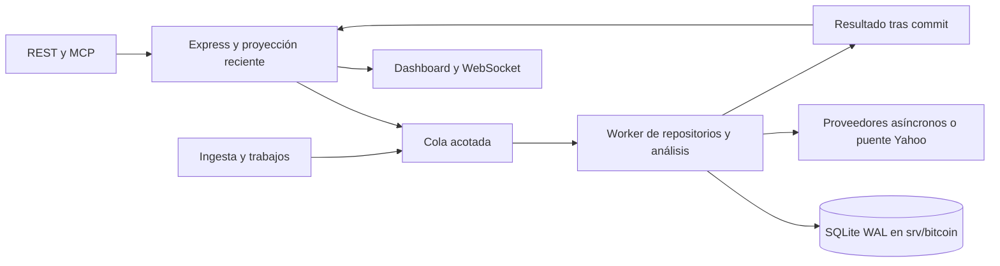

# Almacenamiento, worker y siguientes entregas

Estado al 9 de octubre de 2026: el flujo de noticias ya guarda antes de analizar; feed diario y riesgo usan SQL, y adquisición RSS/proveedores y actualización del dashboard tienen ritmos independientes. Véase [news-sql-pipeline.md](news-sql-pipeline.md). el usuario ha activado el servicio SQLite. Esta revisión corrige señales, conexión RSS, programación por cuotas, cálculos de calendarios/sesiones y errores de Awareness durante la parada. Admin muestra el catálogo RSS completo y escrituras confirmadas, con rotación persistida. Las últimas mejoras requieren un reinicio manual; el agente no ha iniciado ni reiniciado el servicio. Véase [storage-troubleshooting.md](storage-troubleshooting.md). La secuencia del corte inicial permanece en [storage-cutover.md](storage-cutover.md).

La [revisión de entrega del 10 de octubre](production-readiness.md) actualiza las pruebas (628 backend, 23 MCP), corrige permisos/fechas SQL y tamaño del contexto semanal, y mantiene pendiente la aprobación final de producción por latencias observadas y validación prolongada. Las cifras históricas de ensayos más abajo corresponden a sus candidatos originales.

## Implementación disponible

Express coordina HTTP/WebSocket, proveedores y el estado reciente del dashboard. Los adaptadores envían comandos serializables a una cola acotada; el worker ejecuta repositorios, parsers RSS/Awareness y los servicios de investigación/análisis. SQLite reside en `/srv/bitcoin/ogid/db/ogid.sqlite`. No requiere un servidor SQL ni un broker adicional.

El worker conserva las reglas de dominio existentes; varias usan colecciones transitorias dentro del worker. El histórico completo de noticias, ledger y velas no se hidrata en el proceso HTTP. Se mantienen pequeños caches del dashboard, indicadores y alertas. Awareness conserva como máximo 1.000 eventos activos en HTTP; su reconciliación y lectura histórica completa se ejecutan en SQL dentro del worker. IA hidrata los últimos 1.000 registros; las cotizaciones consultan ventanas de hasta 500 observaciones por instrumento.

| Área | Implementación |
|---|---|
| Noticias | Filas, procedencia, enlaces a instrumentos/países/temas, revisiones observadas, aliases, FTS5 y contexto horario. Búsqueda compatible con el substring previo; páginas congeladas por ID y contenido/revisión en tablas temporales persistidas, TTL 15 minutos |
| Eventos e investigación | `SqlResearchStore` con proyecciones relacionales, entidades modificadas por transacción; eventos/evidencias/enlaces con instrumentos, estados oficiales, holdings, facts, forecasts y jobs |
| Mercado | UPSERT por vela y revisión; identidad diaria por sesión local, intradía por apertura exacta; datasets CSV separados del proveedor, observaciones de cotización y trabajos/chunks durables |
| Alertas y consumidores | Escenarios, señales, journal, outbox y checkpoints por consumidor en la misma transacción; IDs y reglas de confirmación conservados |
| Análisis | Técnicos, indicadores, acoplamiento noticias/precio, condiciones, forecasts, portfolio, mapas e inteligencia avanzada se calculan en el worker. Ejecuciones y valores de indicadores se guardan en SQL |
| Awareness | Parser/reconciliación en worker, eventos y estado por fuente, sondeos y auditoría; API/MCP consulta SQL, dashboard usa proyección reciente |
| Pipelines auxiliares | RSS canónico, contexto RSS, señales/buckets, IA, presupuestos y cuotas en SQLite; snapshots pequeños para estado variable y tablas por entidad para los históricos |
| Operación | Migraciones/checksums, manifiestos de importación, ejecuciones/checkpoints de pipelines y diagnóstico cacheado; CLI de importación, integridad, checkpoint y backup consistente |

Los catálogos, `.env`, credenciales, políticas, watchlist y configuraciones pequeñas siguen siendo archivos de configuración. La coordinación de llamadas externas y la proyección actual siguen en Express; SQLite no elimina los límites ni los fallos de los proveedores. El scheduler de créditos específico de TwelveData y los subsistemas de medios mantienen sus stores propios: no formaban parte del corpus grande migrado y requieren adaptación separada si se activa su historial.

## Cola y ciclo de vida

En modo de negocio: máximo 128 comandos y 32 MiB incluyendo activos; máximo 8 MiB por comando, ocho comandos en vuelo. Como máximo dos comandos lentos de red ocupan esos slots, dejando capacidad para consultas y las escrituras que necesita el puente Yahoo. El worker intercalará operaciones mientras espera red; las transacciones SQL siguen siendo síncronas y de un solo escritor. Los adaptadores agrupan noticias/velas en lotes de hasta 100 filas o aproximadamente 128 KiB.

Exceso de carga devuelve `STORAGE_BACKPRESSURE`; una operación en cola puede vencer sin ejecutarse. El timeout de una operación ya despachada devuelve `STORAGE_OUTCOME_UNKNOWN`, termina el worker y provoca la salida del servicio real para que systemd lo recupere. No implica que una escritura no haya ocurrido. Las mutaciones con requestId de dominio conservan idempotencia; las ingestas/UPSERT usan identidades naturales y revisiones. La cola RAM no es un broker durable: un comando aún no confirmado puede perderse al morir el proceso. Los trabajos confirmados, sus chunks y checkpoints viven en SQL y se reanudan mediante la operación existente, sin lanzar descargas históricas automáticamente.

El servicio abre SQL antes de escuchar, exige importación completa y drena ciclos activos/escrituras al parar. Una caída no lleva a un fallback JSON silencioso. Se mantiene WAL, `synchronous=FULL`, FK, timeout de bloqueo acotado y permisos 0700/0600. Los prepared statements se reutilizan en un cache limitado a 256: evita acumular memoria nativa durante una importación grande.

## Migraciones y datos

`001_core.sql`–`003_market_analysis.sql` conservan el esquema inicial. Las ampliaciones se añaden mediante `004_runtime_repositories.sql`, `005_pipeline_state.sql`, `006_event_links.sql` y `007_relation_indexes.sql`. No editar SQL ya aplicado: el arranque verifica el SHA-256 y rechaza versiones desconocidas o alteradas.

| Dominio | Tablas principales |
|---|---|
| Identidad/fuentes | `instruments`, `instrument_aliases`, `sources`, `source_states`, `source_polls` |
| Noticias | `articles`, `article_revisions`, `article_sources`, `article_aliases`, `article_instruments`, `article_countries`, `article_topics`, `articles_fts`, `news_context`, `news_query_snapshots`, `news_query_items` |
| Investigación | `research_rows`, `events`, `event_revisions`, `event_instruments`, `evidence`, `acquisition_jobs` |
| Mercado | `market_datasets`, `candles`, `candle_revisions`, `quote_observations` |
| Análisis/alertas | `analysis_runs`, `indicator_values`, `signal_buckets`, `ai_enrichments`, `alert_rows`, `signal_changes`, `outbox`, `consumer_checkpoints` |
| Awareness/operación | `awareness_events`, `awareness_source_status`, `runtime_audit`, `runtime_snapshots`, `runtime_meta`, `pipeline_definitions`, `pipeline_runs`, `pipeline_checkpoints`, `storage_commands`, `import_manifests`, `schema_migrations` |

Los campos de filtro/orden tienen columnas e índices; metadatos variables se conservan en JSON por fila. Los snapshots RSS/presupuestos/cuotas contienen sólo el estado operativo de esos pipelines, no un blob con todo el archivo de noticias. Los registros anteriores mantienen las revisiones parciales embebidas que contenían; no se inventa el contenido histórico que no se guardó. A partir del corte, las nuevas revisiones SQL conservan sus payloads observados.

Velas: clave `(instrumentId, interval, adjustmentMode, datasetId, sessionKey)`. Los históricos CSV no se mezclan con el proveedor. Las velas abiertas/sintéticas conservan las reglas de admisión existentes. Los IDs de noticia, evidencia, evento, trabajo y cambio se preservan durante la importación.

## Admin y acceso bajo demanda

Se retiró íntegramente Histórico diario de Admin, su módulo JS y su petición de bootstrap. `/api/health` y `/api/admin/pipeline-status` sólo leen diagnóstico cacheado del almacenamiento; abrir Admin no lanza integridad, backfill ni el histórico.

| API explícita | Operación MCP existente |
|---|---|
| `GET /api/admin/history` | `admin.history.status` |
| `GET /api/market/history/jobs` | `market.history.job` |
| `GET /api/market/history/datasets` | `market.history.datasets` |
| `POST /api/market/history/jobs` / `run` | `market.history.create` / `market.history.run` |
| `POST /api/admin/history/import` | `admin.history.import` |

Se mantienen scopes/perfiles, IDs y envelopes REST/MCP. El histórico se carga sólo por esas peticiones; las consultas habituales de gráficos son ventanas locales. Las lecturas del agregado RSS/mapa/inteligencia avanzada usan el estado guardado por defecto en modo SQL; actualizar proveedores requiere la operación de refresh correspondiente. No hay SQL libre expuesto al cliente.

## Validación realizada

- Suite general backend: 616 pruebas aprobadas, incluyendo repositorios/Awareness, RSS primario por worker, catálogo/rotación tras reinicios, lecturas RSS sin reescritura, señales con rollback, caches de calendarios/sesiones y correcciones de velas, intervalos efectivos del scheduler y restauración de backup online con WAL. La comprobación de sintaxis también pasó.
- MCP: 21 pruebas aprobadas, inventario consistente con 68 rutas y 77 operaciones.
- Importación aislada de archivos reales: integridad correcta y cero infracciones de FK; segunda ejecución idempotente cubierta en tests. Se conservaron los originales.
- Candidato del ensayo: 34.797 noticias, 6.608 eventos, 24.394 velas y 2.009 observaciones de cotización. Importación de unos 85 segundos, pico de unos 800 MiB.
- HTTP aislado sobre ese candidato, ingesta externa apagada: búsqueda completa con página de 20 en 1.262 ms; eventos 15 ms; velas 14 ms; 30 peticiones de salud concurrentes, p95 6,7 ms y máximo 18,8 ms. RSS del proceso recién iniciado: 244 MiB, cola vacía y cero comandos fallidos al cerrar.

Los tiempos son un ensayo local, no un SLA ni una prueba prolongada con todos los proveedores/IA. La captura `--check` con el servicio antiguo activo toma snapshots por archivo, no una foto global coherente; producción debe importarse con los escritores detenidos. El fallo de Screen observado y los bloqueos HTTP son fenómenos distintos: el primero fue un abort de Screen; los segundos coinciden con reescrituras/clones grandes y ciclos de fuentes muy largos.

El volumen actual es NTFS3 local en `/dev/sdb1`. El ensayo previo en `/srv/bitcoin` verificó WAL, lectores, exclusión de escritores y recuperación ante SIGKILL; no certifica cortes de alimentación. No se modificó el montaje. Hay backup manual consistente y prueba de reapertura; queda automatizar copias/retención y ensayar una restauración operativa completa.

## Siguientes entregas

1. **Operación:** backup programado con destinos/retención definidos, restauración completa, retención de auditorías, outbox, análisis y comandos, mantenimiento/checkpoint bajo demanda y métricas de lag bajo carga real. Ninguna limpieza histórica nueva se ejecuta automáticamente por este plan.
2. **Análisis histórico:** índice de entradas por ID/revisión/ventana/parámetros y método; invalidación selectiva por vela corregida, recuperación de resultados guardados y evitar duplicados causados sólo por timestamps de consulta. Hoy se guarda la ejecución y se respeta el cache/revisión del servicio existente; todavía no existe esa invalidación histórica integral.
3. **Vistas nuevas:** noticias paginadas con revisiones/evidencia; mercado por rango/dataset con huecos y correcciones; ejecuciones/indicadores por fecha. Cargar al abrir la vista, sin reconstruir Admin ni enviar todo el historial por WebSocket.
4. **Acceso/exportación:** operaciones versionadas para búsqueda FTS por tokens y consulta histórica de análisis/auditoría; exportaciones SQL por rangos y, si se requiere rollback entre motores, exportador consistente. El substring anterior se conserva en las operaciones actuales.
5. **Escala:** medir CPU/latencia del worker durante backfills y análisis extensos. Separar análisis en otro worker si las consultas SQL empiezan a esperar por CPU; evaluar PostgreSQL sólo si aparecen varios escritores/procesos o despliegue distribuido.

Cada entrega debe incluir pruebas de comportamiento, límites de memoria/ventanas y compatibilidad de contratos. El corte actual se realiza exclusivamente siguiendo la [guía manual](storage-cutover.md).
