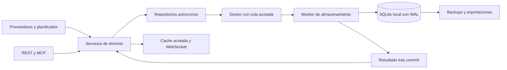

# Plan de almacenamiento e historial de OGID

Investigación y medidas locales: 9 de octubre de 2026. Este documento recoge el diagnóstico previo. Los repositorios de negocio y el worker ya están implementados; el servicio actual sigue pendiente del corte manual descrito en [storage-cutover.md](storage-cutover.md). El [roadmap de implementación](storage-implementation-roadmap.md) concreta las entregas, el esquema y la ubicación en `/srv/bitcoin`.

## Decisión

Migrar progresivamente a **SQLite en disco local, con WAL, repositorios y un worker de almacenamiento**. Conservar Express, proveedores, modelos de dominio, IDs y contratos REST/WebSocket/MCP. SQLite será la fuente persistente; el backend conservará únicamente caches acotadas y las proyecciones que necesita el dashboard.

La recomendación deriva del despliegue actual: una instancia local, 18 instrumentos seleccionados, unas 35.000 noticias y un volumen pequeño respecto a la capacidad de una base relacional. Sí merece la pena sustituir las grandes reescrituras JSON: los índices y las transacciones aportan también búsquedas, revisiones y relaciones históricas que una cola de archivos no resuelve por sí sola. SQLite permite lectores concurrentes con un solo escritor; un gestor central encaja con esa limitación. [Usos recomendados de SQLite](https://sqlite.org/whentouse.html).

No empezar por un microservicio remoto ni por un middleware de Express: la ingestión programada no atraviesa ese middleware. La capa de almacenamiento debe servir por igual a controladores, ingesta RSS/Awareness, mercado, jobs y MCP. No se necesita Redis ni un broker externo para esta escala.

## Estado observado antes de la implementación y prioridades

| Componente | Comportamiento actual | Cambio propuesto |
|---|---|---|
| `NewsArchive` | Archivo de unos 67,5 MB, corpus completo en Map, limpieza y `JSON.stringify`/`writeFileSync` completos en ingestión y contexto | Noticias y revisiones por filas, índices temporales y FTS5; contexto horario separado |
| `ResearchStore` / `EventLedger` | Ledger de unos 12 MB; cada transacción clona todo el estado, lo serializa para validar tamaño y vuelve a serializar para escribir | Comandos de dominio y transacciones por filas; guardar juntos evento, evidencia y cambio |
| `MaterialAlertStore` | JSON con escenarios, señales, consumidores y journal; clones/escrituras síncronas | Tablas y outbox transaccional, checkpoints por consumidor |
| `DailyCandleStore` | E/S de escritura asíncrona serializada; upsert reescribe series completas; hidratación diferida síncrona | UPSERT por identidad, índice temporal y tabla de revisiones |
| `MarketHistoryStore` | Snapshot pequeño y append JSONL con E/S asíncrona | Mantener al principio; migrar observaciones históricas en la fase de mercado |
| Awareness, RSS canónico, señales, IA, cuotas | Mezcla de snapshots y auditorías; varios escritores síncronos | Migrar después de noticias/ledger/mercado según perfil; conservar configuraciones pequeñas en archivos |

La aplicación usa directamente `.state`, `.records`, búsquedas síncronas y `store.transact(fn)`. No basta con cambiar el escritor: hay que mover las consultas al repositorio, introducir `await` y eliminar accesos directos al estado persistente. No se pueden enviar las funciones de `transact(fn)` a otro hilo mediante `postMessage`; deben convertirse en comandos serializables ejecutados dentro de la transacción del worker.

Las velas ya cuentan con identidad diaria por **fecha de sesión en la zona del instrumento**, diferenciada de la apertura intradía. Se debe conservar esa regla; imponer UTC/openTime como única clave diaria rompería la deduplicación existente.

## Ensayo reproducible

Ejecutar en Fedora:

```sh
node deploy/storage/benchmark-storage.mjs
```

El script lee un snapshot atómico existente y crea JSON/SQLite únicamente en un directorio temporal, eliminado al finalizar. No arranca otra instancia de OGID, no consulta proveedores y no cambia producción. Utiliza `node:sqlite` para evitar instalar dependencias durante la investigación; en Node 22 esa API aún avisa de experimental.

Resultados de un ensayo con Node 22.23.3 y SQLite 3.51.3, mientras OGID estaba activo:

| Operación | Resultado |
|---|---:|
| Noticias importadas | 34.973 |
| Tamaño del JSON | 67.528.417 bytes |
| Leer y parsear todo el JSON | 1.709 ms |
| Serializar todo el JSON | 417 ms |
| Escribir y renombrar la copia completa | 145 ms |
| Importar noticias e índice FTS, lotes de 500 | 1.120 ms |
| Actualizar 500 filas y añadir 500 revisiones, una transacción | 22,84 ms |
| Leer últimas 50 filas por índice | 0,33 ms |
| Búsqueda FTS, hasta 20 resultados | 0,38 ms |
| `integrity_check` | `ok` |
| SQLite tras checkpoint, incluyendo payloads e índices | 112.701.440 bytes |
| Retraso p99 del event loop del padre del worker | 10,58 ms, con muestreo de 10 ms |

El prototipo usa un esquema reducido, payloads JSON por artículo e índices de ejemplo. No implementa los contratos, el ledger ni la migración completa. Es un único ensayo con cache del SO y consultas pequeñas; el retraso medido pertenece al proceso del ensayo, no al servidor HTTP. No extrapolar ratios ni prometer esos tiempos en producción. La SQLite medida ocupa más disco que el JSON porque incluye estructura e índices: migrar mejora escrituras/consultas, no garantiza compresión.

## Alternativas

| Alternativa | Valor para OGID | Decisión |
|---|---|---|
| JSON asíncrono + cola | Reduce bloqueo de E/S; sigue serializando corpus, escaneando memoria y reescribiendo archivos | Puente sólo si se necesita aliviar antes de migrar; trabajo reutilizable en cola/métricas |
| SQLite + worker | Transacciones, índices, búsquedas, UPSERT y operación local sencilla | Primera elección |
| PostgreSQL | Servidor relacional con concurrencia y posibilidad de varios clientes/escritores | Elegir directamente si se confirma despliegue en varias máquinas o réplicas con escritores independientes |
| DuckDB + Parquet | Adecuado para explorar series y hacer agregaciones grandes sobre exportaciones | Complemento analítico posterior, no primera fuente operativa |

PostgreSQL usa MVCC para separar lecturas de escrituras; requiere administrar su servicio y sus backups. [Documentación de concurrencia](https://www.postgresql.org/docs/current/mvcc-intro.html). DuckDB concentra el acceso de escritura al archivo nativo en un proceso; su orientación analítica encaja mejor en exportaciones para estudios. [Documentación mantenida por DuckDB](https://github.com/duckdb/duckdb-web/blob/main/docs/current/connect/concurrency.md).

El criterio de cambio a PostgreSQL será la concurrencia real de escritores, crecimiento y latencia sostenida de la cola, no un número arbitrario de noticias. Una web accesible por LAN no exige por sí sola una base remota. Mantener repositorios y migraciones SQL explícitas facilitará el cambio; no será automático porque FTS5 y algunos tipos SQL difieren.

## Arquitectura objetivo



Propuesta de módulos: `backend/storage/StorageManager.js`, `storageWorker.js`, `migrations/` y repositorios de noticias, eventos, mercado, alertas y jobs. Los nombres son orientativos; se implementarán dentro de la arquitectura existente, evitando una nueva capa de abstracción en cada servicio.

Un worker posee la conexión escritora y procesa comandos acotados. Inicialmente puede atender lecturas cortas en esa misma conexión; si se mide espera significativa, añadir un worker lector con conexión read-only. No abrir una conexión por petición ni duplicar el corpus completo en el proceso HTTP. Consultas históricas deben paginar y enviar resultados pequeños; caches del dashboard han de tener límite de filas/bytes y caducidad.

Driver instalado en la primera fase: **`better-sqlite3@13.0.3` dentro del worker**, fijado en el lockfile y con SQLite 3.53.4 comprobada. Su API es síncrona y contempla workers para consultas grandes. [Documentación del proyecto](https://github.com/WiseLibs/better-sqlite3). La alternativa nativa `node:sqlite` reduce dependencias, pero en el baseline Node 24 sigue catalogada como release candidate y sus operaciones `StatementSync` son síncronas. [Documentación Node 24](https://nodejs.org/docs/latest-v24.x/api/sqlite.html). Elegir el driver no sustituye el aislamiento del hilo HTTP.

Workers sirven para aislar serialización y operaciones síncronas/CPU; la E/S asíncrona ya disponible no necesita por sí misma otro hilo. [Node worker_threads](https://nodejs.org/api/worker_threads.html). El análisis, clasificación y composición de snapshots siguen consumiendo CPU en sus servicios: perfilar esos puntos y moverlos también si siguen produciendo retrasos.

### Escritura, durabilidad y recuperación

- Cola limitada por número **y bytes**, con métricas, plazo de espera y contrapresión. Al saturarse, reducir/pausar la adquisición y devolver un error explícito; no aceptar trabajo que sólo vive en una cola ilimitada.
- Lotes pequeños y transacciones cortas. Un comando conserva IDs, revisión e idempotency key. La respuesta de éxito y la publicación de cambios durables ocurren después del commit.
- Guardar cambios de negocio, revisiones y outbox en la misma transacción. Un dispatcher lee la outbox y marca el procesamiento; consumidores deduplican por ID/secuencia. WebSocket continúa siendo transporte sin recibo durable del usuario.
- Jobs persistidos antes de llamadas externas, claims y recuperación de pendientes al reiniciar. Un timeout IPC no implica que la transacción se haya revertido: consultar/reintentar por la misma idempotency key.
- SIGTERM: detener nuevas tareas, drenar trabajo aceptado, cerrar conexiones. Si el worker falla o el disco se llena, propagar estado degradado/fallo y preservar la base; no recrearla vacía ni confirmar escrituras fallidas.

Una sola `ogid.sqlite` permite transacciones entre noticias, evidencias y cambios. Separar bases en WAL no da atomicidad conjunta entre archivos. Usar almacenamiento local, `foreign_keys=ON`, `busy_timeout` acotado y `synchronous=FULL` inicialmente; medir luego el coste antes de cambiar durabilidad. WAL requiere gestión de checkpoints y lectores de duración limitada. [SQLite WAL](https://sqlite.org/wal.html), [PRAGMA synchronous](https://sqlite.org/pragma.html#pragma_synchronous).

En 2026 SQLite documentó un error de WAL corregido en 3.51.3 y con backports específicos. La implementación deberá comprobar `sqlite_version()` y fijar una versión corregida; el motor del ensayo local, 3.51.3, cumple. La versión SQLite del CLI o de Fedora no demuestra cuál incorpora un paquete npm. [Corrección WAL-reset](https://sqlite.org/wal.html#the_wal_reset_bug).

## Historial que habilita la migración

| Dominio | Tablas / identidad | Información que conservar |
|---|---|---|
| Noticias | `articles`, `article_revisions`, `article_observations`, `article_sources`, `article_instruments`, países/temas y FTS | ID actual, contenido permitido, URL, publicación/primera observación, actualización y procedencia; revisiones realmente observadas |
| Eventos | `events`, `event_revisions`, `evidence`, relaciones con artículos/instrumentos | Identidad de publicación/fuente y wire, estado de evidencia, revisiones y correcciones; no contar republicaciones como corroboración independiente |
| Instrumentos | `instruments`, `instrument_aliases`, `watchlist_membership` | `instrumentId` estable, símbolos por proveedor/fechas, bolsa, moneda, zona horaria y cambios de pertenencia |
| Mercado | `quote_observations`, `candles`, `candle_revisions`, `corporate_actions`, `acquisition_jobs` | Hora de mercado y de recepción, fuente/calidad; raw frente a ajustes y acciones corporativas verificadas |
| Investigación | Contexto horario, escenarios/señales/versiones, forecasts/resultados, cartera fechada, outbox/checkpoints | Evidencia disponible en el momento de la hipótesis, cambios por consumidor y metodología usada |
| Operación | Estado de proveedores, polls, gaps, jobs, `schema_migrations`, manifiestos de importación | Cobertura real, fallos, enfriamientos, versión de esquema y trazabilidad |

Índices iniciales: noticias por `(published_at, id)` y por `(received_at, id)`, relaciones `(instrument_id, article_id)` y filtros de país/tema; velas por `(instrument_id, interval, adjustment_mode, dataset_id, session_key)`; observaciones por instrumento/hora/fuente; outbox por secuencia y consumidor. La clave intradía usa apertura exacta, la diaria fecha de sesión local; `dataset_id` mantiene separados datos canónicos y estudios/importaciones. UPSERT sólo cuando cambian valores relevantes; una lectura o refresco idéntico no crea una revisión nueva.

FTS5 indexará exclusivamente título/extracto permitido y se actualizará en la misma transacción que el artículo. Sus búsquedas por tokens difieren del substring usado hoy: preservar la semántica de `news.search` durante la transición o versionar explícitamente la ampliación. Los cursores firmados/snapshots deben mantener expiración, orden estable y ausencia de duplicados; una paginación SQL sin preservar el snapshot no cumple ese contrato. [FTS5](https://sqlite.org/fts5.html).

El historial permitirá consultar qué noticias se conocían antes/después de movimientos de un símbolo, estudiar ventanas de retorno y revisar hipótesis sin introducir datos publicados después. Mantener separados `publishedAt`, `receivedAt`, tiempos de evento y tiempos de mercado; preservar datos sintéticos/stale y su calidad sin convertirlos en evidencia real.

El polling actual aporta **observaciones periódicas y OHLCV**, no ticks de operaciones ni libro de órdenes. No llamar intradía completo a series con huecos ni inferir causalidad de una coincidencia noticia/precio. Las políticas headline-only siguen aplicándose al archivo y al índice.

No pueden reconstruirse noticias ya podadas ni versiones históricas que nunca se guardaron. La migración conserva lo existente y el historial más rico comienza desde su activación. Ampliar retención y backfill depende de cobertura/licencia del proveedor; una base nueva no amplía por sí sola la ventana histórica de Yahoo.

## Fases implementables

1. **Baseline y contratos.** Medir event-loop lag, tiempos de HTTP/WS, memoria/RSS, ingestión y escrituras; inventariar IDs, revisiones, cursores, políticas y accesos directos. Añadir observación de backlog, commits, WAL y errores de disco. Perfilar una sesión normal y una adquisición histórica.
2. **Infraestructura SQLite.** Driver fijado, motor corregido y FTS5 verificados, migraciones versionadas, worker y gestor acotado. Comandos explícitos, idempotencia, errores y apagado. Pruebas sobre bases temporales: transacciones, crash/reapertura, cola saturada, `SQLITE_BUSY` y disco/escritura fallida. No hacer migración de producción en esta fase.
3. **Noticias + ledger primero.** Repositorios asíncronos; ingesta, búsqueda y eventos sin escanear/clonar todo el estado. Separar contexto horario. Preservar IDs, contratos y cursores. Importar snapshots a una base candidata con manifiesto y comparación de resultados. Este bloque aporta el alivio inmediato mayor.
4. **Mercado e investigación.** Migrar velas/observaciones, alertas, escenarios, jobs y checkpoints. Conservar fechas de sesión, modos de ajuste, revisiones e importaciones separadas. Mantener tests REST, WebSocket y MCP; comparar resultados de indicadores, condiciones y acoplamiento.
5. **Corte controlado.** Parar brevemente el servicio para un snapshot final coherente de todos los stores, conservar originales y completar/repetir importación idempotente. Verificar recuentos, hashes de campos permitidos, claves, revisiones, coverage y búsquedas; ejecutar `integrity_check`/`foreign_key_check`. Cambiar el backend de almacenamiento y arrancar. Una sola fuente escritora; evitar dual-write indefinido sin reconciliación.
6. **Historial ampliado y operación.** Ajustar retenciones, consultas temporales, FTS y outbox; backups y restauración probada; exportación analítica opcional a Parquet/DuckDB. Observar crecimiento y cola antes de ampliar universo/frecuencia.

Las fases son entregas revisables, no una reescritura conjunta de frontend/backend. La capa de contratos `backend/contracts/ogidOperations.js` debe conservarse y validarse con sus pruebas de proyección; esta tarea no la modifica. Sólo cambiar contratos públicos cuando una ampliación lo exija y hacerlo de forma aditiva/versionada.

### Backup y rollback

Antes del corte: conservar snapshots fuente sin sobrescribir; manifiesto con versión, checksum, recuentos, fecha, IDs rechazados y motivos. Importación reiniciable sin duplicar filas, con salida explícita ante corrupción. No importar secretos/configuración dentro de payloads de investigación.

Después del corte: backups consistentes mediante API de backup o mecanismo equivalente soportado por el driver; no copiar únicamente el `.sqlite` abierto ignorando WAL. Comprobar restauración en un directorio separado antes de considerar operativo el backup. [SQLite Online Backup](https://sqlite.org/backup.html).

Antes de escrituras nuevas SQL, rollback puede volver al snapshot antiguo. Después de ellas, **volver al JSON viejo perdería cambios**: detener ingesta, exportar una proyección consistente de los stores al formato anterior y conservar la base/revisiones completas. No presentar como rollback seguro un simple cambio de flag hacia archivos desactualizados. Si el formato antiguo no representa el nuevo historial, preservar la base y restaurar una versión de aplicación compatible en vez de truncar silenciosamente.

### Criterios de aceptación

- Mismos IDs/resultados/orden y proyecciones de REST, WebSocket y MCP en casos existentes; cursores y snapshots reproducibles.
- No reescrituras proporcionales a todo el corpus para ingestiones pequeñas; archivo y ledger sin carga histórica completa en el hilo HTTP.
- Ante caída tras commit, recuperación sin perder cambios confirmados ni duplicar por idempotencia; backup restaurable.
- Medir bajo ingesta normal y backfill concurrente: objetivo inicial a validar, p95 HTTP local <200 ms en endpoints ligeros y p99 event-loop lag <50 ms. Separar consultas analíticas grandes. No afirmar cumplimiento con el ensayo aislado.
- Memoria acotada por caches/cola; cola que drena entre ciclos; métricas de WAL, huecos y cobertura visibles. Si no cumple, perfilar analítica y separar lectores antes de cambiar de motor por intuición.

## Capacidad y límites reales

El filesystem `/home` tiene unos 26 GB libres y está al 89 %. El volumen actual de intel ronda 100 MB y las velas 24 MB. SQLite no necesita cargar su archivo entero en RAM, pero índices, revisiones, backups y exportaciones aumentarán disco.

Como cota orientativa, 18 símbolos todos 24x7 con velas de cinco minutos producen `18 × 288 × 365 = 1.892.160` filas/año; los símbolos con sesión bursátil producen menos. No estimar bytes sólo con el precio: medir filas reales, índices y revisiones. Definir presupuesto de disco y política por dominio antes de habilitar retención indefinida: por ejemplo diarios de largo plazo, intradía con horizonte decidido y resúmenes históricos/exportaciones posteriores. Backups y compactación también requieren margen temporal.

El supervisor y la primera fase de worker/cola/migraciones quedan implementados. La infraestructura SQL selecciona `/srv/bitcoin/ogid/db/ogid.sqlite`; los datos de negocio todavía no se han importado ni cortado a SQL. El resto de este documento conserva las medidas del análisis inicial; la ejecución vigente se detalla en el [roadmap](storage-implementation-roadmap.md).
